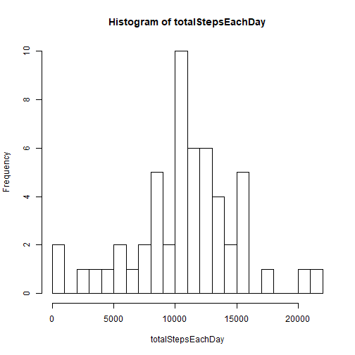
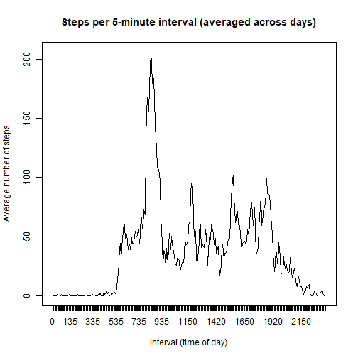
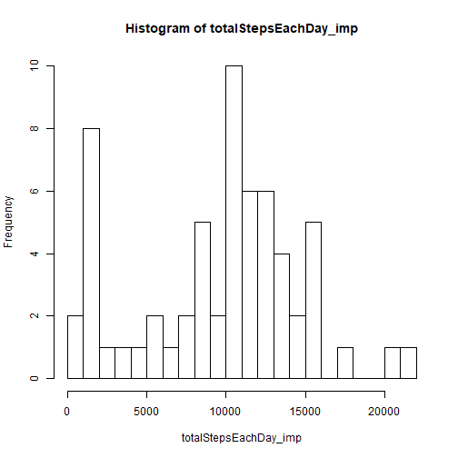
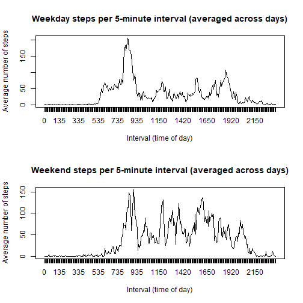

# Coursera "Reproducible Research" course, week 2 project

====================================================================

## Background
This assignment uses data from the UC Irvine Machine Learning Repository, 
 a popular repository for machine learning datasets.
 More info is available here: http://archive.ics.uci.edu/ml/

 The data for the project are located here:
  https://d396qusza40orc.cloudfront.net/repdata%2Fdata%2Factivity.zip

 The objectives of this script are as follows:  
 1) download, unzip, read in, and pre-process the data.   
 2) calculate the mean/median steps per day  
 3) detail the average daily activity pattern  
 4) impute missing values  
 5) identify differences between weekend and weekday activity levels  

To run this code, set your desired working directory below

```r
file_location <- "C:/Users/Jon/Desktop/temp/course5week2/"
setwd(file_location)
```

Run the commented-out lines if you do not have these packages already installed:

```r
#install.packages("curl")  
#install.packages("dplyr")  
#install.packages("lubridate")  
library(curl)  
library(data.table)  
```

```
## data.table 1.11.8  Latest news: r-datatable.com
```

```r
library(lubridate)  
```

```
## Warning: package 'lubridate' was built under R version 3.5.2
```

```
## 
## Attaching package: 'lubridate'
```

```
## The following objects are masked from 'package:data.table':
## 
##     hour, isoweek, mday, minute, month, quarter, second, wday,
##     week, yday, year
```

```
## The following object is masked from 'package:base':
## 
##     date
```


# Part 1: Loading and preprocessing the data

Download and read in the data

```r
dataURL <- "https://d396qusza40orc.cloudfront.net/repdata%2Fdata%2Factivity.zip"
download.file(dataURL, 
              destfile = paste0(file_location, "activityMonitoringData.zip"),
              method = "curl")
dateDownloaded <- date()
```

Unzip these files to the same directory

```r
zipFile <- paste0(file_location, "activityMonitoringData.zip")
unzip(zipFile)
```

Load the data

```r
activityData <- read.csv(paste0(file_location, "activity.csv"))
```

Set the date column as a date value

```r
activityData$date <- ymd(activityData$date)
```

# Part 2: What is the mean number of steps taken per day?

Calculate and plot the total steps for each day

```r
totalStepsEachDay <- tapply(activityData$steps, activityData$date, sum)
hist(totalStepsEachDay, breaks=20)
```



Get the mean total number of steps taken per day

```r
mean(totalStepsEachDay, na.rm=TRUE)
```

```
## [1] 10766.19
```

Get the median total number of steps taken per day

```r
median(totalStepsEachDay, na.rm=TRUE)
```

```
## [1] 10765
```


# Part 3: What is the average activity pattern?

Calculate the number of steps per interval, averaged across days

```r
stepsPerInterval <- tapply(activityData$steps, activityData$interval, mean, na.rm=TRUE)
```

Plot the time series of the average number of steps taken for each 5-minute interval, averaged across days

```r
intervals <- names(stepsPerInterval)
plot(stepsPerInterval, xaxt="n", main="Steps per 5-minute interval (averaged across days)", xlab="Interval (time of day)",
     ylab="Average number of steps", type="l")
axis(1, at=1:length(intervals), labels=intervals)
```



Which 5-minute interval, on average across all the days in the dataset, contains the maximum number of steps?

```r
# which interval has the most steps? (835, with 206 steps)
names(stepsPerInterval[stepsPerInterval==max(stepsPerInterval)])
```

```
## [1] "835"
```

# Part 4: Imputing missing values

Calculate and report the total number of missing values in the dataset (i.e. the total number of rows with NAs)

```r
sum(is.na(activityData$steps))
```

```
## [1] 2304
```

Create a new dataset that is equal to the original dataset but with the missing data filled in.
Here, for any NA, impute (replace) with the median number of steps for the same interval (across days)

```r
imputedSteps <- activityData
for(interval_number in intervals){
  imputedSteps$steps[imputedSteps$interval==interval_number & is.na(imputedSteps$steps)] <- 
    median(imputedSteps$steps[imputedSteps$interval==interval_number], na.rm=TRUE)
}
```

Make a histogram of the total number of steps taken each day. 

```r
totalStepsEachDay_imp <- tapply(imputedSteps$steps, imputedSteps$date, sum)
hist(totalStepsEachDay_imp, breaks=20)
```



Calculate and report the mean and median total number of steps taken per day. 

```r
mean(totalStepsEachDay_imp)
```

```
## [1] 9503.869
```

```r
median(totalStepsEachDay_imp)
```

```
## [1] 10395
```

Do these values differ from the estimates from the first part of the assignment?   
* Yes, both the mean and median number of steps per day are lower after imputation.  
What is the impact of imputing missing data on the estimates of the total daily number of steps?    
* The histogram with imputation is the same except it adds 8 observations of ~2000 steps.
 This seems to indicate that there are 8 days with totally missing observations, and the
 rest of the days are fairly (or totally) complete.

# Part 5: Are there differences in activity patterns between weekdays and weekends?
  
Determine the day of the week for each date and create a factor for whether it is a weekday
or a weekend day.

```r
imputedSteps$weekday <- weekdays(imputedSteps$date)
imputedSteps$weekend <- as.factor(ifelse(imputedSteps$weekday %in% c("Saturday", "Sunday"), "Weekend", "Weekday"))
```

Plot the time series for weekends vs. weekdays of each 5-minute interval

```r
# get the number of steps per interval, averaged across days (weekend or weekdays)
weekend_tapply <- as.data.frame(tapply(imputedSteps$steps, list(imputedSteps$interval, imputedSteps$weekend), mean, na.rm=TRUE))
intervals <- rownames(weekend_tapply)
par(mfcol=c(2,1))
plot(weekend_tapply$Weekday, xaxt="n", main="Weekday steps per 5-minute interval (averaged across days)", xlab="Interval (time of day)",
     ylab="Average number of steps", type="l")
axis(1, at=1:length(intervals), labels=intervals)
plot(weekend_tapply$Weekend, xaxt="n", main="Weekend steps per 5-minute interval (averaged across days)", xlab="Interval (time of day)",
     ylab="Average number of steps", type="l")
axis(1, at=1:length(intervals), labels=intervals)
```




